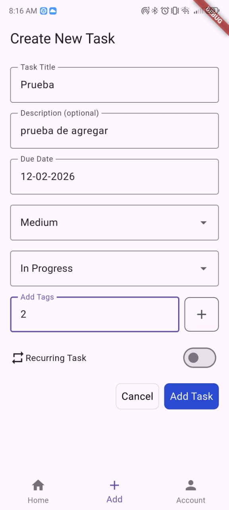
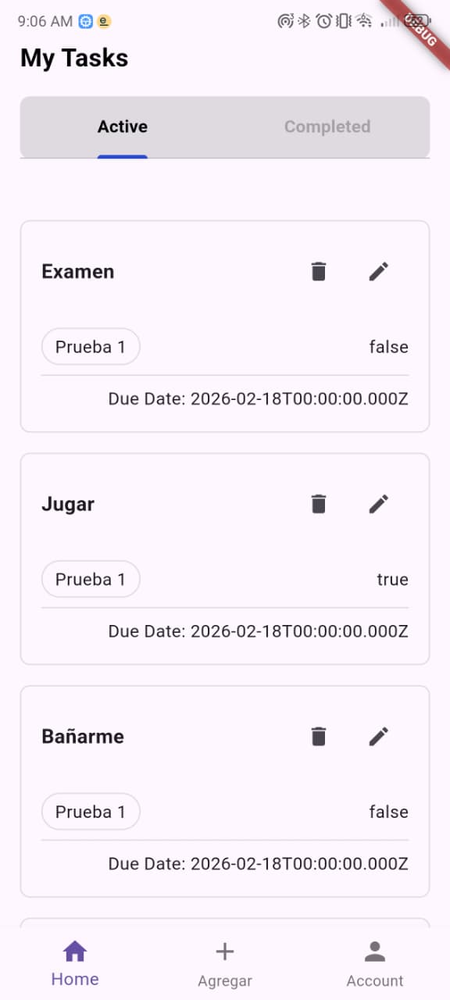

# Task Manager App 
Esta es una aplicación móvil creada por los alumnos del 6to semestre de IDS para el examen parcial de la materia Desarrollo de Aplicaciones Móviles.  
Dicha app tiene el objetivo de permitir la creación, visualización, modificación y eliminación de tareas o actividades por parte del usuario.  
La aplicación fue construida en Flutter (front-end) y Node (back-end). Por medio de Node se creó una API para comunicarse con una base de datos en Microsoft Server SQL (mssql). El IDE utilizado para la construcción de la aplicación fue Visual Studio Code (VS Code).

## Ejecución
### Back-end

### Instalación
Esta back-end esta construido en Node.js, framework de javascript para la creación y gestión de servidores. Para inicializar correctamente Node, dentro de la carpeta del back-end, ejecutar el siguiente comando en la terminal del IDE.
```bash
npm init -y
```
Las dependencias necesarias para la ejecución del back-end son express(comunicación http), mssql(base de datos SQL) y nodemon(persistencia y reinicio de Node). Para instalar estas dependecias, ejecute el siguiente comando en la terminal del IDE.
```bash
npm i express mssql nodemon -D
```
Para poder conectar el back-end a la base de datos, dirijase al archivo en la ruta 
 `backend/src/config.js`. Ingrese al archivo y modifique los datos de la configuración con los datos referentes a su base de datos. Se recomienda no modificar el valor "server".

  

```bask
const dbconfig = { 
    "user": "sa", // Database username
    "password": "passwordDB", // Database password
    "server": "localhost", // Server IP address 
    "database": "Taskexpress", // Database name
    "options": {
        "encrypt": false, // Disable encryption
    },
} 
```

Para ejecutar o correr el back-end Node ejecute el siguiente comando en la terminal del IDE.
```bash
npm run dev
```
Al ejecutar dicho comando, se mostrarán en la terminal los siguientes mesajes que indican que la conexión a la base de datos es exitosa.
```bash
Connected to SQL Server!
API listening in http://localhost:3010
```

### Front-end
Flutter necesita el paquete o despendecia "http", el cual permite la comunicación con el backend por medio de este protocolo. Para instalarlo, ingrese a la carpeta del front-end, y ejecute el siguiente comando en la terminal del IDE.
``` bash
flutter pub add http
```

Para ejecutar el front-end en Flutter debe usarse un emulador o un telefono móvil físico. Es recomendada la segunda opción por la dirección de IPs y mejor manejo de la interfaz. Conecte el móvil a la computadora por medio de un cable, seleccione el dispositivo en donde el proyecto será ejecutado y presione F5 o en la opción de "ejecutar" del IDE. Tardará un momento en compilarse e instalarse la aplicación. Cuando la aplicación este totalmente instalada puede desconectar el cable y probar la conectividad del móvil con el back-end. 

## Consultas
Las consultas fueron probadas por medio del cliente HTTP Thunder Client. Las consultas permiten la visualización de todas las tareas, creación, actualización y eliminación de tareas específicas. En la siguiente lista se presentan las direcciones y métodos HTTP utilizados. Tenga en cuenta que "id" y "isDone" son números enteros.
* Lista de tareas (GET):  ` http://localhost:3010/api/tasks ` 

Dividir si las tareas si estan:
* No completados: ` http://localhost:3010/api/tasks/recurring`  
* Completados: ` http://localhost:3010/api/tasks/completed`  


* Creación de tarea (POST):  ` http://localhost:3010/api/tasks ` 

* Actualización de isDone de tarea (PUT):  ` http://localhost:3010/api/tasks/id/isDone `  
* Eliminación de tarea (DELETE):  ` http://localhost:3010/api/tasks/id ` 


 
Para crear una tarea debe utilizarse el forma json presentado. Tengase en cuenta que "priority" tiene las opcioens "High", "Medium", "Low"; tambíen que "status" puede ser "Pending", "In Progress", "Completed", "Canceled"; y por último "recurringTast" o "isDone" puede ser 0 o 1. 
```javascript
{
    "title": "titulo",
    "description": "descripción",
    "dueDate": "02-18-2026",
    "priority": "High",
    "status": "In Progress",
    "recurringTask": 0
}

```

## Evidencias
captura de 3 tareas
creación de tarea 
tarea marcada como hecha


En la imagen 2 se presenta el ingreso de los atributos de una nueva tarea. Dicha tarea es registrada y almacenada por la API del backend




En la imagen 3 se observa las tareas agregadas



Imagen 3, se elimina una tarea.


